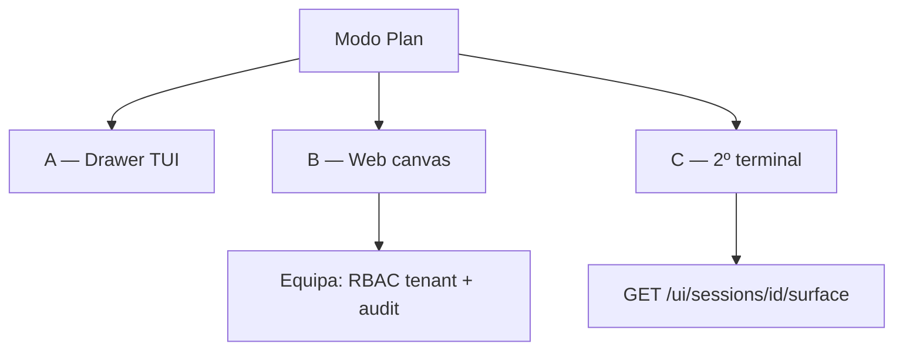

# CentralChat CLI — Especificação de UX (TUI)

> **UPDATED:** 2026-06-18  
> **Status:** Canónico para redesign do CLI (`vhosts/CentralChat_CLI`)  
> **Audiência:** produto, engenharia CLI  
> **Relacionado:** `docs/CLI_RUNTIME_MODES.md` (modos TEAM/SOLO), `docs/RUNBOOK_STAGING.md`, web `LoginPage`, dashboard TanStack

---

## CHANGELOG

| Data | Resumo |
|------|--------|
| 2026-06-15 | Spec inicial: onboarding, multi-tab workspace, P2 daemon, slash commands, alinhamento web |
| 2026-06-15 | `/model`: catálogo vendor + `model_id` concreto; presets como atalhos apenas |
| 2026-06-15 | §13: governança inferência — provider keys e allowlist global/tenant só admin; sem bypass |
| 2026-06-15 | Implementação P0–P3c no CLI: router, splash, login, hub, daemon, slash, tabs |
| 2026-06-15 | Polish: `/ui/workspaces`, tabs interactivas, `model_override`, `/session open`, temas dark/light |
| 2026-06-15 | §18 P2: tema Central JSON (Glamour), blocos incrementais no streaming |
| 2026-06-15 | §18 Markdown no chat (Glamour P1): pipeline, cache, streaming plain, env off |
| 2026-06-15 | §15 Plan Canvas (3 caminhos P5) · §16 P4 polish visual (OpenCode-inspired) |
| 2026-06-18 | Referência `CLI_RUNTIME_MODES.md`; TEAM funde daemon em AgentRuntime; SOLO skip login |

---

## 1. Princípios

1. **Um ponto de entrada:** `central` abre a aplicação completa (não obrigar `login` + `workspace` + `tui` separados).
2. **Produto, não shell:** login, workspace, daemon e sessão são **ecrãs** da mesma app.
3. **Versatilidade de auth:** email, device code e API key com **mesmo peso**; último método usado é o default.
4. **Multi-workspace:** vários projetos em **tabs** persistentes **em cima do chat**.
5. **Paridade conceptual com a web:** mesma paleta semântica, copy PT-BR e fluxos OIDC/device alinhados.
6. **Slash commands:** selecção de modelo, tools, agentes, memory, etc. **dentro do chat** (hoje em grande parte **em falta** — ver §8).

---

## 2. Máquina de estados

```
Splash → BootCheck → Login? → Hub (tabs) → Daemon gate (P2) → Sessão (chat)
                              ↑__________________|
                              (trocar workspace / logout)
```

| Estado | Entrada | Saída |
|--------|---------|-------|
| Splash | `central` | Boot automático |
| Login | sem token válido | Hub após auth |
| Hub | autenticado | Sessão nova/retomada |
| Daemon gate | workspace activo, daemon offline | Sessão ou read-only |
| Sessão | hub ou retomar | Hub (`Ctrl+H`) |

---

## 3. Identidade visual

### 3.1 Wordmark ASCII (v1)

Block letters grandes na **splash** e **login**; compacto no header da sessão.

```
 ██████╗███████╗███╗   ██╗████████╗██████╗  █████╗ ██╗
██╔════╝██╔════╝████╗  ██║╚══██╔══╝██╔══██╗██╔══██╗██║
██║     █████╗  ██╔██╗ ██║   ██║   ██████╔╝███████║██║
██║     ██╔══╝  ██║╚██╗██║   ██║   ██╔══██╗██╔══██║██║
╚██████╗███████╗██║ ╚████║   ██║   ██║  ██║██║  ██║███████╗
 ╚═════╝╚══════╝╚═╝  ╚═══╝   ╚═╝   ╚═╝  ╚═╝╚═╝  ╚═╝╚══════╝
        approve · audit · workspace
```

- Terminal &lt; 70 colunas: fallback `CENTRAL` uma linha + subtítulo.
- Cores lipgloss: accent na wordmark, dim no subtítulo (mapear tokens web §7).

### 3.2 Splash

- Duração 0,8–1,5 s; `Enter`/`Esc` salta.
- Linha de progresso: `API · auth · workspace`.
- Versão CLI no rodapé (`central --version`).

---

## 4. Login (integrado)

### 4.1 Tabs (mesmo peso)

| Tab | Uso |
|-----|-----|
| **Email** | email + password + API URL (avançado) |
| **Device code** | código + spinner; copy igual à web |
| **API key** | `ck_…` para CI/automação |

**Default:** último método usado (`~/.config/central/auth_preferences.json` → `last_method: email|device|api_key`).

### 4.2 Restrição por tenant (futuro)

Admin pode desactivar métodos; tab desactivada mostra mensagem + contacto admin.

### 4.3 Acções

- `[ Entrar ]` · `[ Doctor ]` (painel lateral) · `[ Sair ]`
- Erros: reutilizar mensagens PT de `internal/clierrors` e web (`LoginPage` toasts).

---

## 5. Multi-workspace com tabs (em cima do chat)

**Decisão:** barra de tabs **sempre visível no topo da sessão** (e no hub). Não esconder tabs só no hub.

### 5.1 Wireframe — sessão completa

```
CENTRAL · titulo sessao                    [Sair] Ctrl+L logout · Ctrl+C quit
[ CentralChat × ] [ payment-svc × ] [ + Abrir ]
────────────────────────────────────────────────────────────────────────────
│ CONVERSA (~72%)                          │ CONTEXTO (~28%)              │
│                                          │ Teste                        │
│ █ user message…                          │ Context                      │
│   + Thought: 820ms                       │ 8,050 tokens                 │
│   assistant reply…                       │ 42% used                     │
│   ▣ Build · 8.2s                         │ openrouter/free              │
│                                          │                              │
│                          8.1K (42%)      │ Reasoning · Ctrl+T           │
│ █ Mensagem…                              │ ~/path:branch                │
│   Plan                                   │ • Central 0.x                │
│              Ctrl+P comandos · Tab · t   │                              │
```

Layout estilo OpenCode (P4c+): header full-bleed; chat com **empty state** (ASCII compacto + tools/skills); input retangular ~3 linhas; sidebar com labels azuis (Context, Model, Turno, Inferência, Reasoning); stats no canto inferior direito após conversa iniciada.

### 5.2 Comportamento das tabs

| Acção | Efeito |
|-------|--------|
| Click tab | Activar workspace; `POST /ui/workspace` com path da tab; recarregar sessões/pending |
| `×` | Fechar tab (confirmar se stream activo) |
| `+ Abrir` | Picker: `.`, recentes, path manual |
| `Ctrl+Tab` / `Ctrl+Shift+Tab` | Próxima / anterior |
| `Ctrl+W` | Fechar tab actual |
| `Ctrl+H` | Voltar ao **hub** do workspace activo (lista sessões) |

### 5.3 Persistência local

| Ficheiro | Conteúdo |
|----------|----------|
| `workspaces.json` | tabs: `id`, `path`, `label`, `last_used_at` |
| `active_workspace_id` | tab seleccionada |
| `auth_preferences.json` | `last_method`, último email |

### 5.4 API (evolução)

**Hoje:** multi-bind por `GET/POST /ui/workspaces`; header `X-Central-Workspace-Id` resolve path registado.  
**Legado:** `POST /ui/workspace` actualiza binding activo e upsert na lista.

---

## 6. Hub (por workspace activo)

Antes de abrir o chat, ecrã intermédio opcional (ou painel `Ctrl+H`):

- Card do repo: branch, dirty, daemon, pending count
- `[ Nova sessão ]` `[ Retomar última ]` `[ Approvals ]`
- Lista sessões recentes **deste workspace**
- Work items / queue (read-only link para web se viewer)

---

## 7. Daemon (P2 — prioridade explícita)

- UI **arranca** `central daemon` como subprocesso (PID em `daemon.pid`).
- Chip: `● online` | `◐ a arrancar` | `○ offline` | `⚠ erro`
- Acções: Reiniciar · Ver logs · Parar
- Primeira vez: modal de consentimento; recusar → **read-only** (`--offline` semantics)
- Setting: “Manter daemon ao sair” (default: sim no piloto)

---

## 8. Slash commands (`/`) — estado actual vs. plano

### 8.1 O que existe hoje (TUI — Jun 2026)

| Comando / fluxo | Comportamento |
|-----------------|---------------|
| `central` | Splash → login (3 tabs) → hub → daemon gate → sessão |
| `/help` | Lista slash commands + atalhos |
| `/model` | Catálogo (`GET /ui/cloud-models`) + tab Presets (Tab) |
| `/agent` | Lista agentes; `/agent use <nome>` |
| `/tools` | Toggle `use_agent_tools` na sessão |
| `/memory` | Status preferências memória |
| `/session` | Lista sessões via API |
| `/approve` | Lista approvals pendentes |
| `/workspace` | Volta ao hub (Ctrl+H) |
| `/doctor` | API + ready + providers + daemon |
| `/thinking` | Alterna secção Reasoning no painel direito |
| `/logout` | Revoga token → ecrã login (Ctrl+L) |
| `/exit` | Fecha a app (Ctrl+C quando idle) |
| `/` no input | Slash palette (filtro incremental) |
| `Ctrl+L` | Logout (termina sessão auth) |
| `Ctrl+C` | Cancela stream ou fecha app |
| `Ctrl+T` | Toggle Reasoning no painel direito |
| `Ctrl+P` | Palette UI: painel, reasoning, refresh |
| `t` | Toggle thought inline na última resposta |
| `@ficheiro` | Imagens anexadas; outros ficheiros como `[ref:path]` no prompt |
| Tabs workspace | Barra no topo da sessão (persistência `workspaces.json`) |

### 8.2 Modelo de interacção (alvo)

1. Utilizador escreve `/` no input → abre **slash palette** (overlay, não envia mensagem).
2. Filtro incremental: `/mod` → `/model …`
3. `Enter` aplica; `Esc` cancela.
4. Comandos com **sub-selecção** abrem segundo nível (lista modelos, agentes, etc.).

```
┌─ Comandos ─────────────────────────────┐
│ /model    Escolher modelo de inferência │
│ /agent    Agente de equipa activo      │
│ /tools    Activar/desactivar tools     │
│ /memory   Memória / RAG / contexto     │
│ /session  Nova · listar · renomear     │
│ /approve  Pending · diff · approve     │
│ /workspace  Trocar tab / bind          │
│ /help     Ajuda                        │
└────────────────────────────────────────┘
```

### 8.3 Selecção de modelo (`/model`) — catálogo completo

**Requisito de produto:** o utilizador deve poder escolher **qualquer modelo permitido** pelo catálogo (`openai/gpt-4o-mini`, `anthropic/claude-3.5-sonnet`, …), não apenas presets agregados (eco / balanced / premium / A·B·C).

Presets são **atalhos**, não o único modo de selecção.

#### 8.3.1 Dimensões de inferência (como o backend resolve)

| Dimensão | Exemplo | API / persistência | Papel |
|----------|---------|-------------------|--------|
| **`model_id` concreto** | `openai/gpt-4o-mini` | `POST /ui/preferences` → `llm_model_id` | **Principal** — escolha explícita no catálogo |
| **Destino** | `local` \| `api` | `assistant_preferences.inference_destination` | Onde corre o LLM |
| **Perfil UI** | A / B / C (Eco / Equilibrado / Performance) | `GET/POST /ui/profile` → router `eco` \| `balanced` \| `quality` | Atalho de router local |
| **Auto-tier** | `economy` \| `balanced` \| `premium` | `assistant_preferences.auto_tier` | Pacote automático quando `llm_model_id` vazio |
| **Catálogo user** | modelos enabled no **subconjunto permitido** | `GET /ui/cloud-models` (já filtrado pelo servidor) | Preferência pessoal dentro do tenant |
| **Modality (avançado)** | summary, vision, … | `modality_models` em `/config` | Modelos por papel auxiliar |
| **Aux / embedding** | compactação, RAG | `aux_llm_model_id`, `embedding_model_id` | Sub-menu avançado |

**Regra de UX:** quando `llm_model_id` está definido, a sidebar mostra o **ID ou label** do modelo; o preset só aparece como metadata secundária (`via eco`).

#### 8.3.2 UI do comando `/model` — duas abas

```
┌─ /model ─────────────────────────────────────────────────────────┐
│  Activo: openai/gpt-4o-mini · api · allowlist ✓                  │
│  ┌──────────────┬──────────────┐                                 │
│  │  Catálogo ●  │  Presets     │                                 │
│  └──────────────┴──────────────┘                                 │
│  Pesquisar: [ gpt-4█________________________ ]  Pg 1/12  ▲▼   │
│  ┌────────────────────────────────────────────────────────────┐  │
│  │ ▸ openai/gpt-4o-mini          128k ctx    enabled          │  │
│  │   openai/gpt-4o               128k ctx    enabled          │  │
│  │   anthropic/claude-3.5-sonnet 200k ctx  disabled (policy)│  │
│  │   google/gemini-2.0-flash     …                           │  │
│  └────────────────────────────────────────────────────────────┘  │
│  [ Aplicar à sessão ]  [ Default do user ]                        │
└──────────────────────────────────────────────────────────────────┘
```

**Tab Catálogo (default):**

- Fonte: `GET /ui/cloud-models` — lista **já intersectada** pelo servidor (global ∩ tenant ∩ providers com key ∩ infra disponível); ver §13
- Pesquisa incremental no TUI (filtra `id` + `label`)
- Paginação se lista > ~15 linhas
- Modelos não elegíveis — **não aparecem** (ou cinza com motivo: `policy`, `sem provider`, `fora do tenant`)
- `Enter` → `POST /ui/preferences` com `llm_model_id`; servidor **revalida** (403/400 se bypass tentado)
- Utilizador **não** gere allowlist global/tenant na CLI — só escolhe dentro do permitido; admin usa web/API §13

**Tab Presets (atalhos):**

| Preset | Acção |
|--------|--------|
| Eco / A | `POST /ui/profile` → A; opcional limpar `llm_model_id` para auto-router |
| Equilibrado / B | idem B |
| Performance / C | idem C |
| Auto-tier economy / balanced / premium | patch `auto_tier`; limpar `llm_model_id` se “deixar pacote escolher” |
| Local / API | toggle `inference_destination` |

**Sub-comando avançado** (palette ou `/model advanced`):

- `aux` — `aux_llm_model_id`
- `embedding` — `embedding_model_id`
- `modality <role>` — roles de `modality_models` (summary, vision, …)

#### 8.3.3 Persistência por âmbito

| Âmbito | Campos | Quando |
|--------|--------|--------|
| **Sessão** | override em memória TUI + próximo `AskRequest` / stream | troca rápida só nesta conversa (P3a+) |
| **User default** | `POST /ui/preferences` | “Default do user” no picker |
| **Perfil router** | `POST /ui/profile` | presets A/B/C |

*Nota implementação:* `AskRequest.model_override` no stream + `POST /ui/preferences` para default user; CLI envia ambos conforme §8.3.3.

#### 8.3.4 Policy e erros

- Modelo fora do conjunto permitido → **recusado no servidor** (`policy_model_denied`, `llm_model_id_formato_invalido`); CLI mostra mensagem PT, **sem bypass local**
- Path sensível + cloud fora da allowlist global → deny (D-MODEL-1; `policy_engine`)
- `inference_resolve_error` de `/config` → banner na sidebar com `/doctor`
- Cloud sem override permitido → “Este perfil cloud não aceita model_id manual”
- Provider sem key configurada (admin) → modelo não listado ou badge `sem credencial`

---

### 8.4 Catálogo canónico de slash commands (resto)
| Comando | Descrição | Fonte de dados | Persistência |
|---------|-----------|----------------|--------------|
| `/model` ou `/models` | **Catálogo vendor + presets** (§8.3) | `GET /ui/cloud-models`, `/ui/preferences`, `/ui/profile` | user + sessão |
| `/agent` ou `/agents` | Lista `team agents`; `use` activa agente na sessão | API | por sessão |
| `/tools` | Toggle tool families (file, shell, web…) conforme policy | API config + policy | por sessão |
| `/memory` | Subcomandos: `status`, `clear`, `rag on/off` se flags activas | API + session patch | por sessão |
| `/session` | `new`, `list`, `rename`, `open <id>` | API chat-sessions | — |
| `/workspace` | Abre picker / lista tabs | local + API bind | tabs locais |
| `/approve` | `pending`, `diff <id>`, `approve <id>`, `reject` | API approvals | — |
| `/thinking` | (já existe) painel reasoning | local TUI | `tui.toml` |
| `/doctor` | Checklist inline | API health + daemon | — |
| `/help` | Lista actualizada + link doc | estático | — |

**Aliases:** aceitar `/m` → `/model` quando unívoco.

### 8.5 `@` — menções (extensão)

| Sintaxe | Uso |
|---------|-----|
| `@path/to/file` | Anexo (hoje: só imagem; **alvo:** qualquer ficheiro permitido pela policy) |
| `@folder/` | Contexto de pasta (futuro H4 / AST) |
| Diferente de `/` | `@` = **referência no prompt**; `/` = **comando de UI/sessão** |

### 8.6 Prioridade de implementação slash

| Fase | Comandos |
|------|----------|
| **P3a** | `/model` **catálogo + search + presets tab**, `/agent`, `/help`, palette `/` |
| **P3b** | `/tools`, `/memory`, `/session`, `/approve` |
| **P3c** | `@` ficheiros não-imagem, `/workspace` |

### 8.7 Wireframe — slash palette sobre o chat

```
├──────────────────────────────────────────────────────────┤
│  > /mod█                                                 │
├──────────────────────────────────────────────────────────┤
│  ┌─ / ────────────────────────────────────────────────┐  │
│  │ ▸ /model   Catálogo (gpt-4o-mini, claude, …)      │  │
│  │            Presets · local/api · auto-tier        │  │
│  │   /memory  status · clear · rag                     │  │
│  └───────────────────────────────────────────────────┘  │
│  (setas + Enter; Tab completa)                           │
└──────────────────────────────────────────────────────────┘
```

---

## 9. Alinhamento CLI ↔ Web

| Aspecto | Web | CLI |
|---------|-----|-----|
| Login email | `LoginPage` card | Tab Email |
| OIDC | redirect browser | Tab Device code |
| Erros auth | toast PT | linha + estilo `destructive` |
| Cores | CSS `primary`, `muted`, `destructive` | lipgloss equivalente |
| Dashboard | supervisão | CLI = trabalho; **web admin** = `vhosts/centralchat_admin` (:5175) |
| Model hub | Admin: providers + allowlist global/tenant | `/model` tab **Catálogo** = catálogo efectivo `GET /ui/cloud-models` |

Copy partilhada (exemplos canónicos):

- “Sessão expirada. Inicia sessão novamente.”
- “API inacessível. Verifica o staging ou `CENTRAL_API_URL`.”
- Device: “Usa o código abaixo no browser ou no dashboard.”

---

## 10. Comandos CLI após redesign

| Comando | Papel |
|---------|--------|
| `central` | App completa (default) |
| `central login` | Opcional; scripts/CI |
| `central workspace` | Opcional; automação |
| `central daemon` | Opcional; UI gere em P2 |
| `central ask`, `approve`, … | Automação; não fluxo principal |
| `central models`, `agents` | Debug; **duplicado** por `/model`, `/agent` na TUI |

---

## 11. Fases de entrega

| Fase | Entrega | Estado |
|------|---------|--------|
| **P0** | Router ecrãs, splash ASCII, login 3 tabs, `last_method` | ✅ |
| **P1** | Tabs multi-workspace **em cima do chat**, hub, picker, `GET/POST /ui/workspaces` | ✅ |
| **P2** | Daemon subprocess + chip + logs | ✅ |
| **P3a** | Slash palette + `/model` catálogo (paginação, sessão vs default) + `/agent` | ✅ |
| **P3b** | `/tools` `/memory` `/session` (`open <id>`) `/approve` | ✅ |
| **P3c** | `@` ficheiros, polish sessão, temas `dark`/`light` em `tui.toml` | ✅ |
| **G1–G4** | Governança inferência §13 | ✅ |
| **§4.2** | Restrição auth por tenant | ⏳ adiado (stub) |
| **P4** | Polish OpenCode: theme, login card, Plan/Build, painel métricas | 🚧 |
| **P5** | Plan Canvas (§15 — 3 caminhos) | ⏳ planeado |

---

## 12. Riscos

| Risco | Mitigação |
|-------|-----------|
| Tabs vs. binding único no servidor | API `/ui/workspaces` + sync CLI; re-bind por tab activa |
| Wordmark em terminal estreito | fallback compacto |
| Slash explosion | catálogo fixo §8.3; `/help` gerado |
| Daemon subprocess zombies | PID file + cleanup on exit |

---

## 13. Governança de inferência (admin · tenant · membro)

**Princípio:** a selecção de modelo na CLI/TUI respeita **disponibilidade da infra**, **permissões do membro** e **política do tenant** — **nunca bypass** via cliente (CLI, curl, UI).

### 13.1 Camadas (quem configura o quê)

```mermaid
flowchart TB
  subgraph admin_global [Admin — global]
    PK[Provider keys vault]
    GA[Allowlist modelos global]
    INF[Flags infra: router, local LLM, OpenRouter…]
  end
  subgraph admin_tenant [Admin — por tenant]
    TA[Allowlist modelos tenant]
    POL[Políticas PG models.allowlist]
    QUO[Quotas / rate / DLP tenant]
  end
  subgraph member [Membro — developer/approver]
    UM[Preferência user: enabled + llm_model_id]
    SEL[/model na sessão]
  end
  PK --> CAT[Catálogo efectivo API]
  GA --> CAT
  INF --> CAT
  TA --> CAT
  POL --> CAT
  CAT --> UM
  CAT --> SEL
```

| Camada | Quem | O quê | Onde (actual / alvo) |
|--------|------|-------|----------------------|
| **Provider keys** | **Admin** apenas | Várias keys (OpenRouter, Anthropic, Google, …); rotação; nunca no cliente | **Alvo:** vault + `admin/inference/providers`; hoje: `OPENROUTER_API_KEY` env único |
| **Allowlist global** | **Admin** apenas | Modelos cloud permitidos na instalação | `CENTRAL_CLOUD_MODEL_ALLOWLIST` + **alvo:** `PUT /admin/inference/models/global` |
| **Infra** | Ops / admin | Model-router, LLM local, destinos `local`/`api` | `MODEL_ROUTER_URL`, compose/helm |
| **Allowlist tenant** | **Admin** tenant | Subconjunto do global; pode restringir mais, **nunca alargar** além do global | `tenant_config.features_json`, políticas `models.allowlist` (PG) |
| **Preferência user** | Membro (RBAC) | Activar/desactivar modelos **dentro** do tenant; escolher `llm_model_id` | `GET/PUT /ui/cloud-models`, `POST /ui/preferences` |
| **Sessão** | Membro | Override temporário **⊆** user permitido | TUI `/model` → validação server-side |

### 13.2 Múltiplas keys de provedor (só admin)

- Uma instalação Central pode ter **N providers** com credenciais distintas (conforme contrato e região).
- **Apenas `admin`** cria/edita/revoga keys (web dashboard ou API admin); armazenamento em **vault** / secrets K8s — nunca em `~/.config/central` do utilizador.
- O catálogo vendor (`GET /ui/cloud-models`) só inclui modelos cujo **provider está configurado e healthy**.
- Membro **não** pode colar API key no CLI para contornar (rejeitar endpoints user-side; keys só server-side).

**Wireframe admin (web) — fora do CLI, referência:**

```
Admin → Inferência → Providers
  [ + Adicionar provider ]
  openrouter    ● configurado   [rotacionar] [remover]
  anthropic     ○ não configurado [configurar]
  google        ● configurado   [rotacionar]
```

### 13.3 Allowlist global vs tenant (só admin)

| Acção | Global | Tenant |
|-------|--------|--------|
| Definir lista de `model_id` permitidos | Admin instalação | Admin tenant |
| Alargar além do global | — | **Proibido** |
| Restringir subset | — | Permitido |
| Paths sensíveis + cloud | `CENTRAL_CLOUD_MODEL_SENSITIVE_PATHS` + global allowlist | policy tenant |

**Decisão D-MODEL-1 (HARDENING_PLAN):** global + override tenant; deny fora da lista em paths sensíveis.

Endpoints admin (alvo canónico):

| Endpoint | Role | Função |
|----------|------|--------|
| `GET/PUT /admin/inference/models/global` | `admin` | Allowlist global + metadata |
| `GET/PUT /admin/tenant-config/{tenant_id}` | `admin` | Incl. `features_json.models_allowlist` |
| `GET/PUT /admin/inference/providers` | `admin` | Metadados keys (sem expor secret) |
| `GET /admin/policies` | auditor+ | Snapshot políticas |

Utilizador com role `developer` / `approver`: **só leitura** do catálogo filtrado; `PUT /ui/cloud-models` limitado a **toggle enabled** dentro do tenant (não adicionar IDs arbitrários — **alvo**; validar no servidor).

### 13.4 Catálogo efectivo (o que o `/model` mostra)

```
catálogo_efectivo =
  vendor_models(providers_configured)
  ∩ allowlist_global
  ∩ allowlist_tenant
  ∩ policy_models_allowlist (PG)
  ∩ infra_disponível (local/gpu, router online)
  ∩ opcional: user_enabled flags
```

- CLI **não calcula** interseção localmente — confia em `GET /ui/cloud-models` pós-filtro.
- Se lista vazia: mensagem acionável (“Nenhum modelo disponível — contacta admin do tenant”).
- RBAC: `viewer` / `auditor` podem ver catálogo read-only; mutação de `llm_model_id` só roles que já podem usar assistente (`developer`, `approver`, `admin`).

### 13.5 Anti-bypass (obrigatório)

| Tentativa | Resposta |
|-----------|----------|
| `POST /ui/preferences` com `llm_model_id` proibido | 400 + `policy_model_denied` / validação preferências |
| Tool call em `payment/` com modelo cloud não allowlisted | `policy_engine` deny + audit `policy.violation` |
| CLI patch local / header forged | Ignorado; JWT + tenant scope + revalidação inferência |
| User `PUT /ui/cloud-models` com ID fora do tenant | **Alvo:** 403 `model_not_in_tenant_catalog` |
| Colar provider key no CLI | Não suportado; sem endpoint |

### 13.6 Impacto no CLI UX

| Elemento | Comportamento |
|----------|----------------|
| `/model` Catálogo | Só modelos do catálogo efectivo |
| Sidebar `model:` | `model_id` + badge se restrito (`tenant`, `global`) |
| `/doctor` | Linha “Providers: 2/3 configurados”; “Modelos disponíveis: N” |
| Presets local (A/B/C) | Só se `inference_destination=local` e infra local up |
| Presets api / cloud | Só se pelo menos um provider admin-configurado |

### 13.7 Fases de implementação (backend + admin UI)

| Fase | Entrega |
|------|---------|
| **G1** | Filtrar `GET /ui/cloud-models` por global ∩ tenant; validar `PUT` user |
| **G2** | Admin API providers (vault) + allowlist global CRUD |
| **G3** | Web admin: providers + modelos global/tenant |
| **G4** | CLI `/model` + mensagens anti-bypass alinhadas |

---

## 15. Modo Plan / Build e Plan Canvas (P5)

### 15.1 Modo Plan / Build (P4c — CLI)

| Modo | Cor input | Semântica MVP |
|------|-----------|---------------|
| **Plan** | Barra laranja (`214`) | `use_agent_tools=false` — planejar sem mutar repo |
| **Build** | Barra azul (`39`) | `use_agent_tools=true` — executar (default) |

- **Tab** no input alterna Plan ↔ Build (excepto quando slash palette ou overlay activo).
- Chip **dentro** da caixa de input (rodapé da caixa): **Plan** ou **Build**; modelo activo no painel direito (Context).
- Stats (`8.1K (42%)`) no canto inferior direito do chat, só após conversa iniciada.
- Painel direito minimalista: título da sessão, tokens, % used, modelo, reasoning colapsável, path:branch, branding.
- Mensagens user: barra azul `█`; assistant: `+ Thought` → texto → `▣ Build · Ns` (`t` expande thought).
- Hints discretos: `Ctrl+P comandos · Tab Plan/Build · t thought` no rodapé do chat.
- **Logout:** `[Sair]` / `/logout` / **Ctrl+L** → revoga token e volta ao login; **Ctrl+C** / `/exit` fecha a app (cancela stream se activo).

Backend futuro: `interaction_mode: plan|build` no stream (P4c+).

### 15.2 Plan Canvas — três caminhos (P5)

No modo **Plan**, o modelo deve poder **escrever num artefacto** (plano, passos, pseudo-diff) visível fora do thread e **partilhável com a equipa** no tenant.



#### Caminho A — Drawer no painel direito (TUI)

| Aspecto | Detalhe |
|---------|---------|
| **UX** | Secção **Plano** no painel direito (toggle `Ctrl+G`); markdown renderizado em texto; scroll |
| **Fonte** | `GET/PATCH /ui/sessions/{id}/plan` (futuro) ou ficheiro local sincronizado |
| **Prós** | Rápido; zero dependência web; mesmo terminal |
| **Contras** | Diffs ricos limitados; partilha = export ou API |
| **Fase** | P5a |

#### Caminho B — Web canvas (browser)

| Aspecto | Detalhe |
|---------|---------|
| **UX** | URL `…/sessions/{id}/plan` ou comando `central plan open`; preview HTML/markdown |
| **Base actual** | SSE evento `canvas` no backend; `LiveCanvas.tsx` no frontend (não ligado) |
| **Prós** | Melhor para equipa não-dev; diffs visuais; rich preview |
| **Contras** | Integração frontend + persistência + auth |
| **Partilha** | Mesmo tenant (roles existentes); link read-only opcional v2 |
| **Fase** | P5b |

#### Caminho C — Segundo terminal

| Aspecto | Detalhe |
|---------|---------|
| **UX** | `central session open <id>` noutro terminal; vê mensagens + plano quando API expuser |
| **Base actual** | `GET /ui/sessions/{id}/surface` — fase, mensagens, approval, clarify |
| **Prós** | Já funciona para retomar sessão; natural para devs |
| **Contras** | Menos acessível a PM/design |
| **Fase** | P5a (surface + plan body) |

### 15.3 Regra de produto

1. **Plan** — escreve no canvas; repo intocado (tools off ou só `canvas_patch` allowlisted).
2. **Build** — tools + loop HITL (`approval` → `diff` → PR em staging).
3. Transição: Tab → Build ou acção **“Aprovar plano e implementar”** (checkpoint audit).

### 15.4 Contrato API futuro (esboço)

```
GET  /ui/sessions/{id}/plan     → { format, body, version, updated_at }
PATCH /ui/sessions/{id}/plan    → merge body
POST /assistant/text/stream     → { interaction_mode, canvas_write }
SSE  plan_patch                 → { op, section, text }
```

### 15.5 Fases P5

| Fase | Entrega |
|------|---------|
| **P5a** | Artefacto `plan_document` + drawer TUI ou surface com corpo do plano |
| **P5b** | Web: ligar `LiveCanvas` + página sessão/plano |
| **P5c** | Partilha tenant (dashboard readonly); sem co-editing realtime na v1 |
| **P5d** | Build mantém approvals/diff actuais |

---

## 16. P4 — Polish visual (OpenCode-inspired)

| Onda | Entrega |
|------|---------|
| **P4a** | `theme.go` — `CentralTheme`, list active (`bg 24`), progress bar, cards |
| **P4b** | Login/hub em card centrado; logout vs quit |
| **P4c** | Chat esquerda + painel direito OpenCode; message cards; reasoning no sidebar | ✅ |
| **P4c+** | Input ancorado ao fundo; sidebar minimalista; header full-bleed; stats canto dir. | ✅ |
| **P4d** | Slash overlay 2 colunas; modal `/model` centrado; `/logout` `/exit` |
| **P4e** | Aceite visual + esta secção |

**Cores lista (não copiar pêssego OpenCode):** linha activa `bg 24` + `fg 255` + `▸` azul `39`.

---

## 17. Referências de código (estado Jun 2026)

| Área | Path |
|------|------|
| App router (P0+) | `vhosts/CentralChat_CLI/internal/ui/root.go` |
| Splash / estilos | `internal/ui/styles.go`, `theme.go` |
| Layout helpers | `internal/ui/layout.go`, `session_layout.go`, `session_messages.go` |
| Markdown chat (P1) | `internal/ui/markdown_render.go` |
| Login + hub | `internal/ui/login_hub.go` |
| Workspaces tabs | `internal/ui/workspaces.go` |
| Daemon manager | `internal/ui/daemon_mgr.go` |
| Slash palette | `internal/ui/slash_palette.go` |
| TUI sessão | `vhosts/CentralChat_CLI/internal/ui/app.go` |
| Login cobra | `internal/commands/login.go` |
| Catálogo modelos API | `GET /ui/cloud-models` (`app/user_config.py`) |
| Preferências LLM | `POST /ui/preferences` → `llm_model_id`, `auto_tier`, `inference_destination` |
| Perfis router A/B/C | `GET/POST /ui/profile` (`app/shared/profiles.py`) |
| Models CLI (debug JSON) | `internal/commands/models.go` |
| Agents CLI | `internal/commands/agents.go` |
| Policy modelos | `app/shared/policy_engine.py` (`models.allowlist`, `CENTRAL_CLOUD_MODEL_ALLOWLIST`) |
| Allowlist global env | `app/config.py` → `CENTRAL_CLOUD_MODEL_ALLOWLIST` |
| Tenant config | `app/tenant.py`, políticas PG |
| Web login | `vhosts/CentralChat_Frontend/src/components/auth/LoginPage.tsx` |

---

## 18. Markdown no chat (Glamour)

Renderização de markdown nas **respostas finalizadas** do assistente. Motor: [Glamour](https://github.com/charmbracelet/glamour) (Goldmark + Chroma + estilos ANSI), alinhado ao ecossistema Bubble Tea / Lip Gloss.

### 18.1 Princípios

1. **Bonito:** headings, listas, blockquotes, código com syntax highlight no terminal.
2. **Eficiente:** cache por `(hash do conteúdo, largura, tema)`; invalidação em `WindowSizeMsg`.
3. **Robusto:** fallback para `wrapMultiline` (texto plano) em erro, conteúdo > 32 KiB, ou env de desligar.

### 18.2 Fases de renderização

| Fase | Quando | Pipeline |
|------|--------|----------|
| **Streaming** | Tokens SSE activos (`live=true`) | Blocos completos (`\n\n`) → Glamour; último bloco → plain |
| **Finalizada** | Após `__done__` ou mensagem do histórico | `RenderAssistantMarkdown` → Glamour (documento inteiro) |

**P2 (implementado):** estilos JSON `centralMarkdownStyleDark` / `Light` em `markdown_styles.go`; `splitMarkdownBlocks` preserva fences; cache por bloco no stream.

**Roadmap (P3+):** OSC-8 links; drawer Plan reutiliza o mesmo pipeline; tema sincronizado em runtime com `ApplyCentralTheme`.

### 18.3 Onde aplica markdown

| Conteúdo | Markdown |
|----------|----------|
| Resposta assistente (final) | Sim |
| Resposta em streaming | Parcial (blocos fechados com Glamour; cauda plain) |
| Thought | Não (plain dim) |
| Prompt user / system | Não |

### 18.4 Configuração

| Variável | Valores | Efeito |
|----------|---------|--------|
| `CENTRAL_CLI_MARKDOWN` | `off` / `0` / `false` / `no` | Desliga Glamour; só plain |

Tema Glamour: `dark` ou `light` conforme `ApplyCentralTheme`.

### 18.5 Código

| Ficheiro | Responsabilidade |
|----------|------------------|
| `internal/ui/markdown_render.go` | `RenderAssistantMarkdown`, streaming por blocos, cache |
| `internal/ui/markdown_styles.go` | JSON Glamour dark/light alinhado a `theme.go` |
| `internal/ui/session_messages.go` | `renderAssistantBody` — `live` vs final |
| `internal/ui/markdown_render_test.go` | plain off, ANSI on, cache, truncagem |

### 18.6 Limitações v1

- Tabelas largas podem quebrar layout; imagens mostram URL como texto.
- Re-parse completo em cada resize (cache invalidado).
- Sem OSC-8 hyperlinks clicáveis (futuro).
