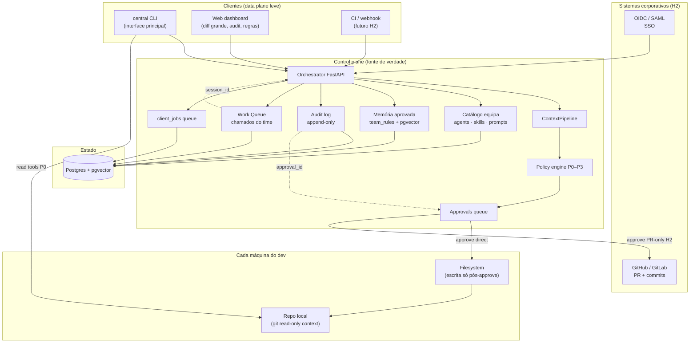

# CentralChat — MVP: Control Plane de Equipa (CLI-first)

> **UPDATED:** 2026-06-14  
> **Status:** Plano canónico para tirar o produto do papel  
> **Audiência:** devs de terminal, equipas, empresas (compliance, audit, política)  
> **Horizonte:** H0 ~12 semanas (MVP); H1–H3 pós-MVP (enterprise + work queue)

---

## CHANGELOG

| Data | Resumo |
|------|--------|
| 2026-06-14 | Documento inicial (web-first, anti-Cursor) |
| 2026-06-14 | Reposicionamento CLI-first vs Hermes pessoal |
| 2026-06-14 | **Fase 1:** CLI Go, workspace API, HITL patch/write, daemon executor |

---

## 1. Resumo executivo

### O que é o CentralChat

**CentralChat** = **control plane self-hosted** para agentes de código:

- **CLI** (`central`) é a interface principal — terminal, rapidez, zero IDE
- **Orchestrator** (FastAPI + Postgres) é a fonte de verdade — sessões, política, agents, skills, regras, approvals
- **Web** é **secundária** — diff grande, audit, regras de equipa, supervisão (não é onde se desenvolve)

### Proposta de valor

**Dev / equipa:**

> *"O orquestrador self-hosted onde a equipa define o que a IA pode fazer — CLI em qualquer máquina, nada no disco sem aprovação, regras partilhadas que só entram se forem aprovadas."*

**Empresa (CISO / eng lead):**

> *"Auditoria e política para IA de código: quem pediu, o que a IA propôs, quem aprovou, que modelo gastou — exportável, ligado ao Git corporativo e ao IdP."*

### Loop do produto

```
central login → central workspace . → central ask "..." → central diff → central approve
```

Estado, agents, skills e prompts vivem no **servidor**. O repo fica **local** em cada máquina; escrita passa sempre pela **fila HITL**.

### 1.5 O que estás a vender (não é GitLab)

**Pergunta frequente:** “Isto parece GitLab — preciso de VPS? O que fica no meu PC?”

| | **GitLab / GitHub** | **CentralChat** |
|---|---------------------|-----------------|
| **Função** | Onde o **código** vive (VCS, PR, CI) | Onde a **governança da IA** vive |
| **Fonte de verdade do código** | Sim — repo remoto | **Não** — o Git corporativo continua a ser GitHub/GitLab |
| **O que guarda** | Commits, branches, pipelines | Sessões IA, diffs propostos, quem aprovou, regras de equipa, audit |
| **Interface do dev** | Web + git CLI | **`central` CLI/TUI** |
| **Escrita em ficheiros** | `git push` | IA propõe → **approval** → CLI escreve local → tu fazes `git commit` |

**Analogia:** GitLab = cofre do código. CentralChat = **sala de controlo dos agentes de código** (política, auditoria, catálogo de skills) que se liga ao teu Git **sem o substituir**.

**O que fica no PC do utilizador (data plane):**

| Local | Conteúdo |
|-------|----------|
| Binário | `central` (CLI/TUI, ~10–20 MB) |
| Repo | O teu projeto Git — **inalterado**, no sítio de sempre |
| Config | `~/.config/central/` (token, API URL, `tui.toml`) |
| Processo | `central daemon` — executa read/patch **só** no workspace autorizado |
| Disco | Ficheiros escritos **após** `central approve` (nunca auto-commit) |

**O que fica no servidor (control plane) — sim, precisa de um sítio central para equipa:**

| Componente | Função |
|------------|--------|
| Orchestrator (FastAPI) | Chat, tools loop, política, SSE |
| Postgres | Sessões, approvals, tenants, audit (H1), work queue (H1) |
| Chaves API (opcional) | OpenRouter / modelos — nível empresa, não no laptop de cada um |

**Precisa de VPS dedicado?**

| Cenário | Deployment |
|---------|------------|
| **Equipa / empresa (core)** | **Sim** — 1 instância partilhada (VPS, homelab, K8s, on-prem). Todos os devs: `central login` → mesmo tenant, mesma política. |
| **Solo / teste local** | Docker no próprio laptop (`startup-testing.sh`) — servidor e CLI na mesma máquina; útil para dev do produto, não é o pitch comercial. |
| **Multi-tenant (core)** | Uma instalação CentralChat pode servir **N clientes** (`client_id` no JWT) — cada empresa/equipa isolada em PG. |

**Pitch de venda (uma frase):**

> Vendes **soberania + política + auditoria** para equipas que usam IA no código — self-hosted, CLI em qualquer máquina, nada no disco sem aprovação, regras partilhadas — **sem** ser Git host, **sem** ser IDE, **sem** ser agente pessoal tipo Hermes.

**O que o cliente compra / opera:**

1. **Instala** o stack (Docker compose ou K8s) num servidor da empresa ou VPS.
2. **Distribui** o binário `central` aos devs (ou `go install` / release GitHub).
3. **Configura** agents, skills, políticas P0–P3 no dashboard (lead/CISO).
4. Devs continuam com **GitHub/GitLab** para PR e CI; CentralChat regista *quem pediu à IA*, *o que propôs*, *quem aprovou* (H1: export audit; H2: trailer `Central-Approval` no PR).

### 1.6 O que tu **provides** ao cliente (modelo comercial — estilo GitLab)

**Pergunta:** Sou SaaS? Open source? Providencio serviço ou infraestrutura? Há versões?

**Resposta curta:** és **fornecedor de software de control plane** com modelo **open core**. No **MVP (H0)** só existe canal **self-managed** — o cliente instala na infra dele. Cloud gerida (SaaS) fica para **H2+**, fora do escopo MVP.

#### O que **tu** entregas (artefactos + opcionalmente serviço)

| Entrega | O quê | Formato |
|---------|-------|---------|
| **Software** | Orchestrator + Postgres migrations + web dashboard | **MVP:** `docker-compose` · **H2:** Helm chart (K8s) |
| **Cliente** | Binário `central` (CLI/TUI + daemon) | Releases GitHub (linux/darwin/windows) |
| **Documentação** | Install, upgrade, backup, tenant setup | Docs site / repo |
| **Atualizações** | Versões semver (`v1.0`, `v1.1`) | Changelog + imagens tagged |
| **Suporte** (pago) | SLA, onboarding, compliance | Contrato enterprise |
| **Cloud gerida** | — | **Fora do MVP** — H2+ |

#### O que o **cliente** traz / opera

| Item | MVP (H0) — **só self-managed** | Cloud (H2+, fora MVP) |
|------|--------------------------------|----------------------|
| Servidor / VPS | **Cliente** provisiona | **Tu** provisionas |
| Postgres, backups | **Cliente** | **Tu** |
| Chaves LLM (OpenRouter, etc.) | **Cliente** (BYOK) | Cliente ou revenda com markup |
| Repo Git + CI | **Cliente** (GitHub/GitLab) | **Cliente** — inalterado |
| Laptops + `central` | **Cliente** | **Cliente** — inalterado |
| Código no disco | **Máquina do dev** — sempre | Idem |

**Importante:** mesmo em SaaS, o **código não sobe para o teu servidor**. Sobe: sessões, approvals, audit, política. O repo fica local — diferente de GitLab.com onde o repo está no teu Git.

#### Três “versões” (não confundir)

| Tipo | Exemplo GitLab | CentralChat |
|------|----------------|-------------|
| **Edição** | Free / Premium / Ultimate | **Community (OSS)** / **Enterprise (licença)** |
| **Release** | 16.8, 17.0 | `v1.0.0`, `v1.1.0` |
| **Canal de entrega** | gitlab.com vs self-managed | **Self-managed** (único no MVP) · Cloud H2+ |

#### Edições propostas (open core)

| Community (open source) | Enterprise (licença comercial) |
|-------------------------|--------------------------------|
| Orchestrator + CLI + TUI | Tudo do Community |
| Auth JWT + multi-tenant `client_id` | Audit log export + retenção longa |
| Sessões + SSE + approvals HITL | RBAC + four-eyes |
| Tools MVP (read/patch/approve) | Policy engine por repo |
| Catálogo equipa (agents/skills) | Work Queue + integrações CI |
| Web dashboard básico | SSO OIDC/SAML |
| Self-hosted ilimitado | Suporte + compliance packs (H3) |

Licença: **Apache-2.0** no Community (decisão **D9**); feature flags `CENTRAL_EDITION=enterprise` ou módulo `enterprise/` para código comercial.

#### Modelo de receita (recomendado)

| Canal | MVP (H0) | Pós-MVP |
|-------|----------|---------|
| **Self-managed** | ✅ **Único canal** — Community OSS + licença Enterprise opcional | Mantém |
| **Cloud / SaaS** | ❌ Fora de escopo | H2+ — subscrição por seat/tenant |
| **Serviços** | Opcional (onboarding, IdP) | Mantém |

#### Posicionamento numa frase

> Software **open core** de governança de IA: no MVP o cliente **instala o control plane no VPS/on-prem dele**, distribui o **CLI**, mantém o **Git onde já está** — tu vendes **software + licença Enterprise**, não hosting cloud no H0.

| Concorrente | Porque não competimos no mesmo terreno |
|-------------|----------------------------------------|
| **Cursor** | IDE integrada — não construímos IDE |
| **Hermes Agent** | Agente **pessoal** monolítico (memória/skills locais) — somos **equipa + governança** |
| **Claude Code / Aider** | CLIs cloud/vendor — somos self-hosted + política explícita |
| **Jira / Linear** | Issue tracker genérico — temos **Work Queue** ligada a sessão IA + diff + audit (não Jira clone) |

### Fora de escopo (acordado)

| Não construir | Motivo |
|---------------|--------|
| IDE própria | Impossível competir com Cursor; devs preferem terminal |
| Git server interno (GitLab clone) | Integrar com Git existente; audit no CentralChat |
| Auto-commit por tool-call | Polui histórico; perigoso |
| Jira completo (sprints, story points) | Work Queue leve apenas |
| UI orbital / Mesa Redonda | Sobrecarga cognitiva |
| 20 canais messaging (Telegram, Slack bot…) | Fora do foco; webhook SIEM chega (H2) |
| Desktop Electron race | Hermes já lançou; CLI-first |
| Skills auto-criadas opacas (estilo Hermes) | Regras/skills **aprovadas** pela equipa |
| **Cloud / SaaS gerida** | MVP só self-managed; cloud em H2+ |

---

## 2. Posicionamento competitivo

### Hermes vs CentralChat (diferencial grosso)

| Dimensão | Hermes Agent | CentralChat |
|----------|--------------|-------------|
| Onde vive o estado | Máquina local (SQLite, perfis) | **Servidor** (Postgres) |
| Skills / agents | Pessoais; agente pode criar sozinho | **Catálogo da equipa**, versionado e governado |
| Partilha entre PCs | Migrar perfil / remote gateway | **`central login`** → mesma org, mesma política |
| Escrita em disco | Configurável | **Policy engine** P0–P3; P1+ sempre approval |
| Audit trail | Local (`/undo` turnos) | **PG imutável** — quem aprovou, quando, diff |
| Superfície principal | CLI / TUI / Desktop | **CLI** (+ web só review) |
| Escala | 1 pessoa, 1 máquina | **N devs, N CLIs, 1 backend** |
| Extensibilidade | 60+ tools, MCP, 20 canais messaging | MVP: tools core + **MCP com policy wrapper** (H1) |

**Analogia:** Hermes = WhatsApp pessoal com IA. CentralChat = **Slack + política + CI** para agentes de código.

### Onde ganhamos (e onde não)

| Ganhamos | Não ganhamos (aceitar) |
|----------|------------------------|
| Self-hosted soberano (sem Nous Portal) | Latência local vs monólito Hermes no laptop |
| Equipa: agents/skills/regras partilhados | Skills auto-criáveis pelo agente (complexo, H2+) |
| Auditoria e compliance (HITL + PG) | 20 canais Telegram/Slack (fora do escopo) |
| Eficiência de tokens (ContextPipeline + budget) | Feature parity com Hermes v0.16 |
| Modelo à escolha (OpenRouter, local) | Desktop Electron race |
| CLI fino + backend escalável | “Agente que aprende sozinho” no curto prazo |

---

## 3. Arquitectura alvo



**Princípio:** CLI não é o agente — é **kubectl** para o control plane. O orchestrator decide política, contexto e roteamento.

**Três camadas de histórico (acordado):**

| Camada | Função | Onde |
|--------|--------|------|
| **1. Audit log CentralChat** | Quem pediu, o que a IA fez, quem aprovou, tokens, modelo | Postgres append-only |
| **2. Git corporativo** | Fonte de verdade do **código**; PR com trailer `Central-Approval: <id>` | GitHub/GitLab |
| **3. Mirror read-only** (opcional) | Cache de repo para contexto — **não** é VCS principal | `workspace_service` |

---

## 4. Estado actual vs alvo

### O que já funciona (reutilizar)

| Capacidade | Onde está | Papel no novo MVP |
|------------|-----------|-------------------|
| Auth JWT + tenant | `app/auth.py` | Login CLI + multi-user equipa |
| Chat + SSE | `app/assistant_routes.py` | Core do tool loop |
| Sessões | `app/sessions.py` | Sessões partilhadas no servidor |
| Approvals HITL | `app/approvals.py` | **Diferencial vs Hermes** |
| Default tools (12) | `app/default_tools.py` | Subset MVP no CLI |
| ContextPipeline | `app/context_pipeline.py` | Eficiência de tokens |
| User agents/skills | `app/user_config.py` | Evolui para **catálogo de equipa** |
| Agent trees | `app/agent_tree.py` | Motor interno (invisível) |
| Jobs | `client_jobs` + `app/connector.py` | Base para workers H1 |
| Docker dev | `startup-testing.sh` | Backend local para CLI |

### O que bloqueia hoje

1. **`CentralChat_CLI` vazio** — interface principal inexistente
2. **Tool loop desligado** — `AGENT_TOOLS_ENABLED=0`
3. **Sem workspace** ligado à sessão
4. **Web tratada como produto** — dev de terminal não usa `:5174` para cada patch
5. **Agents/skills per-user** — ainda não “catálogo de equipa”
6. **Dois motores de contexto** — legado + pipeline

### Stubs (não investir no MVP)

- `vhosts/CentralChat_Desktop/` — só `.git`
- `vhosts/CentralChat_CLI/` — **implementar aqui** (prioridade H0)
- UI orbital, Mesa Redonda, git auto-commit — **não planeado**

---

## 5. Perfil de configuração MVP

Ficheiro: `vhosts/CentralChat_Backend/.env.mvp` → copiar para `.env`.

```bash
CENTRAL_JWT_MODE=required
AUTH_LOGIN_ENABLED=1
CHAT_SESSIONS_ENABLED=1
CONTEXT_PIPELINE_ENABLED=1
AGENT_TOOLS_ENABLED=1
CENTRAL_DEFAULT_TOOLS_ENABLED=1
OPENROUTER_API_KEY=<sua-chave>
CENTRAL_OIDC_ENABLED=0
# Desligar: playbook, atena, multi-slot, RAGs paralelos, platform tools
```

**Tools MVP:**

| Tool | Risk | Comportamento |
|------|------|---------------|
| `read_file`, `search_files`, `list_dir` | P0 | Auto |
| `patch_file`, `write_file` | P1 | Approval obrigatório |
| `terminal` | P2 | Approval + confirmação |

---

## 6. Fases de implementação (H0 — MVP ~12 semanas)

| Fase | Semanas | Entrega | Interface |
|------|---------|---------|-----------|
| **0 — Fundação** | 1–2 | Backend sólido, contexto único | API testável via curl |
| **1 — CLI + workspace** | 3–5 | CLI mínimo + tools read + diff HITL | **CLI principal** |
| **2 — Diff + status** | 6–8 | TUI/diff no terminal + web dashboard opcional | CLI + web review |
| **3 — Equipa + memória** | 9–12 | Regras partilhadas, catálogo agents/skills | CLI `central rules` + web |

---

## Fase 0 — Fundação (semanas 1–2)

**Objectivo:** orchestrator pronto para receber o CLI; um único pipeline de contexto.

### 0.1 Developer Experience

| # | Tarefa | Estado |
|---|--------|--------|
| 0.1.1 | Seed automático `startup-testing.sh` | ✅ Feito |
| 0.1.2 | `README-MVP.md` quickstart | ✅ Feito |
| 0.1.3 | `.env.mvp` | ✅ Feito |
| 0.1.4 | Montar `scripts/` no compose dev | Pendente |
| 0.1.5 | Documentar URL API para CLI: `http://127.0.0.1:8004` | Pendente |

### 0.2 Unificar contexto

| # | Tarefa | Ficheiros |
|---|--------|-----------|
| 0.2.1 | `ContextPipeline` único no chat | `app/assistant_routes.py` |
| 0.2.2 | Deprecar `context/_core.py` no fluxo principal | `app/context/_core.py` |
| 0.2.3 | 5 camadas MVP (ver §11) | este doc |
| 0.2.4 | Testes pipeline | `tests/test_context_pipeline_layers.py` |

### 0.3 Preparar API para CLI

| # | Tarefa |
|---|--------|
| 0.3.1 | OpenAPI estável em `/docs` — contrato CLI |
| 0.3.2 | SSE documentado para `central ask --stream` |
| 0.3.3 | `CENTRAL_PRODUCT_MODE=1` esconde rotas admin no OpenAPI |
| 0.3.4 | Web: esconder Agent Trees da nav principal (secundária) |

### Critérios de aceite — Fase 0

- [ ] `./startup-testing.sh` → API healthy em < 5 min
- [ ] `curl` login + stream funciona
- [ ] Sem duplo build de contexto nos logs

---

## Fase 1 — CLI + workspace + tools (semanas 3–5)

**Objectivo:** dev no terminal faz o fluxo completo sem abrir browser.

### 1.1 CLI mínimo (`vhosts/CentralChat_CLI/`)

**Stack recomendada:** Go ou Rust (binário único, cold start <50ms). Python aceitável para protótipo rápido.

| Comando | Função |
|---------|--------|
| `central login` | JWT → `~/.config/central/credentials` |
| `central workspace [path]` | Bind pasta (default: `.`) |
| `central ask "..."` | Chat one-shot |
| `central ask "..." --stream` | SSE no terminal |
| `central pending` | Lista approvals |
| `central diff [id]` | Pager com unified diff (`delta` se disponível) |
| `central approve <id>` | Aplica patch |
| `central reject <id> [-m reason]` | Rejeita + motivo |
| `central sessions` | Lista sessões do servidor |

**Config local (`~/.config/central/config.toml`):**

```toml
api_url = "http://127.0.0.1:8004"
default_model = "openrouter/..."
```

### 1.2 Workspace Service (backend)

| # | Tarefa | Ficheiros |
|---|--------|-----------|
| 1.2.1 | `app/workspace_service.py` | raiz, validação, git metadata |
| 1.2.2 | `app/shared/workspace_guard.py` | anti path traversal |
| 1.2.3 | `GET/POST /ui/workspace` | por sessão / user |
| 1.2.4 | Header CLI: `X-Central-Workspace: /abs/path` | contrato novo |

**Nota:** no MVP, tools executam no **host onde o CLI corre** (connector pattern) ou via volume Docker em dev. Ver §1.4.

### 1.3 Tool loop + approvals

| # | Tarefa |
|---|--------|
| 1.3.1 | Activar tools MVP (`.env.mvp`) |
| 1.3.2 | `patch_file` / `write_file` → `create_pending` + diff |
| 1.3.3 | `app/shared/diff_builder.py` |
| 1.3.4 | SSE `approval_required` → CLI mostra e espera |
| 1.3.5 | Executor aplica no filesystem após `approve` |

**Fluxo:**

```
central ask "adiciona validação em UserService"
  → orchestrator: read files (P0)
  → orchestrator: propõe patch (P1) → approval_id
  → CLI: "Approval #3 pendente — central diff 3"
  → central approve 3
  → ficheiro escrito localmente
```

### 1.4 Onde correm as tools (decisão MVP)

| Modo | Descrição | MVP |
|------|-----------|-----|
| **A — Local executor** | CLI tem subcomando `central daemon` que executa read/write no host; orchestrator envia jobs | ✅ Recomendado H0 |
| **B — Docker volume** | Repo montado em `/workspaces`; orchestrator escreve no volume | Dev only |

Modo A alinha com “repo local em cada máquina, estado no servidor” — igual ao padrão Hermes local, mas **cérebro remoto**.

### 1.5 Git read-only

- Branch, últimos commits, ficheiros dirty → camada `repo_context` no pipeline (`app/shared/repo_context.py`)
- **Sem** auto-commit
- [x] Implementado em L2 + `GET/POST /ui/workspace` (`git` metadata)

### Critérios de aceite — Fase 1

- [ ] Fluxo completo **só no terminal** (zero browser)
- [ ] Segundo dev com mesmo login vê mesmas sessões no servidor
- [ ] Path traversal bloqueado
- [ ] 100% escritas P1+ passam por approval

---

## Fase 2 — Diff no terminal + web dashboard (semanas 6–8)

**Objectivo:** UX polida no CLI; web só quando o ecrã do terminal não chega.

### 2.1 TUI principal (`central` / `central tui`)

O TUI é a **interface por defeito** para sessão interactiva (como OpenCode). Comandos one-shot (`central ask "..."`) mantêm-se para scripts e rapidez.

| Modo | Comando | Uso |
|------|---------|-----|
| **TUI sessão** | `central` ou `central tui` | Chat interactivo + sidebar fixa |
| **One-shot** | `central ask "..." [--stream]` | Automação, pipes, CI |
| **Watch** | `central watch` | Só painel de status (sem input) |

**Stack recomendada:** Go + [Bubble Tea](https://github.com/charmbracelet/bubbletea) + Lip Gloss (ecosistema maduro, ratatui-like). Alternativa: Rust + ratatui.

Ver **§14** para layout completo, sidebar, imagens e keybinds.

### 2.2 CLI avançado (comandos além do TUI)

| # | Tarefa |
|---|--------|
| 2.2.1 | SSE `status` na sidebar e na área de chat |
| 2.2.2 | `central tokens` / barra de contexto na sidebar |
| 2.2.3 | `central models` — fuzzy (`Ctrl+P` palette no TUI) |
| 2.2.4 | Sessões: `resume`, `fork`; overlay na TUI (`Ctrl+P` → Sessions) |
| 2.2.5 | Anexos: imagem, ficheiro, paste clipboard (ver §14.4) |

### 2.3 Web dashboard (secundário)

| # | Tarefa | Ficheiros |
|---|--------|-----------|
| 2.3.1 | `/dashboard/approvals` — diff grande, side-by-side | web |
| 2.3.2 | `/dashboard/sessions` — audit readonly | web |
| 2.3.3 | Remover chat web como “produto principal” | `index.tsx` → redirect ou modo review |
| 2.3.4 | Login web mantido para supervisão | `LoginPage.tsx` |

**Web não substitui:** `central ask`, `central diff`, `central approve`.

### 2.4 Critérios de aceite — Fase 2

- [ ] `central` abre TUI com sidebar fixa (modelo + contexto)
- [ ] Dev habitual usa TUI para sessões; one-shot para scripts
- [ ] Paste de imagem no prompt funciona (modelos vision)
- [ ] Approval pendente aparece na sidebar + notificação inline
- [ ] Web só para diff > 100 linhas ou audit

---

## Fase 3 — Equipa + memória governada (semanas 9–12)

**Objectivo:** diferencial real vs Hermes — **catálogo partilhado** e **regras aprovadas**.

### 3.1 Catálogo de equipa (evoluir `user_config.py`)

| Entidade | Hoje | Alvo MVP |
|----------|------|----------|
| Agents | `user_agents` per-user | `team_agents` — tenant-wide, versionado |
| Skills | `user_skills` per-user | `team_skills` — publicado por admin |
| Prompts | preferences soltas | `team_prompts` — templates partilhados |
| Modelo default | per-user | policy por tenant |

**CLI:**

```bash
central agents list          # catálogo da equipa
central agent use backend    # selecciona agent para sessão
central skills list
```

### 3.2 Regras aprovadas (memória única)

Migration `009_team_rules.sql` (evoluir `user_rules` → `team_rules`):

```sql
CREATE TABLE team_rules (
  id UUID PRIMARY KEY,
  tenant_id TEXT NOT NULL,
  pattern TEXT NOT NULL,
  source TEXT NOT NULL,       -- 'rejection' | 'manual'
  proposed_by UUID,
  approved_by UUID,
  approved BOOLEAN DEFAULT false,
  embedding vector(384),
  created_at TIMESTAMPTZ DEFAULT now()
);
```

| # | Tarefa |
|---|--------|
| 3.2.1 | `reject -m "motivo"` → extracção async de padrão |
| 3.2.2 | `central rules` — fila pending + approved |
| 3.2.3 | Web `/dashboard/rules` — aprovar regras (lead dev) |
| 3.2.4 | Camada `rules_recall` no ContextPipeline |
| 3.2.5 | Unificar `app/rag.py` → `app/memory_service.py` |

**Princípio:** IA **só aprende o que a equipa aprovou** — diferente de skills auto-criadas pelo Hermes.

### Critérios de aceite — Fase 3

- [ ] Dev B no portátil: `central login` → vê agents/skills/regras da equipa
- [ ] Regra rejeitada e aprovada na máquina A aparece na sessão da máquina B
- [ ] Regras pending nunca entram no prompt

---

## 7. Corporativo / Enterprise (escopo acordado — H1+)

Equipa implica **empresa**. O diferencial corporativo não é substituir Git/Jira — é **auditoria + política + fila de trabalho IA**.

### 7.1 Tier 1 — Enterprise essencial (H1)

#### Audit log append-only (“histórico interno” de IA)

Tabela imutável — sem UPDATE/DELETE na aplicação:

```sql
CREATE TABLE audit_events (
  id UUID PRIMARY KEY,
  tenant_id TEXT NOT NULL,
  user_id UUID,
  session_id TEXT,
  approval_id UUID,
  work_item_id TEXT,              -- H1b — ligação a chamados
  action TEXT NOT NULL,           -- tool.read, tool.propose_patch, approval.approve, ...
  resource TEXT,                  -- path, repo, tool name
  payload_hash TEXT,              -- diff/output hash — não guardar segredos
  model TEXT,
  tokens_in INT,
  tokens_out INT,
  client TEXT,                    -- cli | web | webhook
  ip INET,
  created_at TIMESTAMPTZ DEFAULT now()
);
CREATE INDEX audit_events_tenant_created ON audit_events (tenant_id, created_at);
```

| Evento | Quando |
|--------|--------|
| `auth.login` | CLI / web |
| `session.start` | nova sessão |
| `tool.read` / `tool.search` | P0 auto |
| `tool.propose_patch` | antes de approval |
| `approval.approve` / `approval.deny` | HITL |
| `policy.violation` | path/modelo bloqueado |
| `work_item.created` / `.closed` | fila (§8) |

**Entrega:** export CSV/JSON; retenção configurável (90d–7y); base para SIEM (H2).

#### RBAC (papéis)

| Papel | Permissões |
|-------|------------|
| **viewer** | Ver sessões, audit, queue (read-only) |
| **developer** | `central ask`, ler ficheiros, propor mudanças |
| **approver** | Aprovar/rejeitar diffs |
| **admin** | Catálogo, políticas, utilizadores |
| **auditor** | Export audit; sem chat |

**Four-eyes (opcional):** quem pediu o patch não pode aprovar o próprio (`CENTRAL_APPROVAL_SEPARATION=1`).

#### Políticas por repositório / equipa

```yaml
# tenant_config ou team_policies
repos:
  - pattern: "*/payment/*"
    write: denied
    models: [internal-llm-only]
  - pattern: "*/api/*"
    approval: dual              # 2 aprovadores (H2)
    terminal: denied
  - pattern: "**/.env*"
    read: denied
```

Implementar em `app/shared/policy_engine.py`; avaliar antes de cada tool call.

#### Git corporativo (integração, não git interno)

| Modo | Ambiente | Comportamento |
|------|----------|---------------|
| **direct_write** | dev local | `approve` → escreve no disco |
| **pr_only** | staging/prod | `approve` → abre MR/PR no GitHub/GitLab |

Commit/PR message padrão:

```
central(approval:452): refactor AuthService

Central-Approval: 452
Central-Session: sess-abc
Approved-By: joao@empresa.com
```

#### Catálogo governado (evolução Fase 3)

Agents / skills / prompts: **draft → review → published** (semver). Só `published` em ambientes prod.

### 7.2 Tier 2 — Enterprise maduro (H2)

| Capacidade | Descrição |
|------------|-----------|
| **SSO** | OIDC/SAML (Keycloak, Azure AD, Okta); grupos IdP → roles |
| **Model governance** | Allowlist por tenant; bloquear cloud LLM em paths sensíveis |
| **DLP** | Scanner pré-prompt (regex + classificação) |
| **Segredos** | Vault / K8s secrets; tools não leem `**/credentials/**` sem break-glass |
| **Quotas / chargeback** | `tenant_quotas` — tokens/mês por equipa; alertas |
| **Ambientes** | dev / staging / prod com políticas distintas |
| **Dual approval** | 2 aprovadores em paths críticos |
| **SIEM / webhooks** | Eventos para Splunk/Datadog; notificação Slack/Teams |
| **Sync issues externas** | Link opcional Linear/Jira (`external_url`) — não substituir |

### 7.3 Tier 3 — Diferenciação enterprise (H3)

| Capacidade | Descrição |
|------------|-----------|
| **Compliance packs** | Templates PCI, LGPD dev, ISO27001 coding |
| **Relatórios auditoria** | PDF/JSON: “quem usou IA em `payment/` no Q1?” |
| **Break-glass** | Admin override com audit obrigatório + expiração 1h |
| **Data residency** | Tenant EU: PG + LLM endpoint só EU |
| **Air-gap** | Helm chart on-prem; sem telemetria externa |

### 7.4 CLI / web corporativo

```bash
central audit list [--since 7d] [--user @joao]
central audit export --format csv --output audit-q1.csv
central policy show
```

Web: `/dashboard/audit` — filtros, export, read-only para papel `auditor`.

---

## 8. Work Queue — Chamados do time (escopo acordado — H1+)

Fila de trabalho para **tarefas assistidas por IA** — não Jira clone. Cada item liga sessão, diffs e audit.

### 8.1 Conceito

| Jira / Linear | CentralChat Work Queue |
|---------------|------------------------|
| Ticket manual | Manual + auto (rejeição, CI, policy, falha tool) |
| Comentários | Sessão de chat + `audit_events` |
| Done | Diff aprovado + (opcional) PR mergeado |
| Assignee | Dev + agent/skill do catálogo |

### 8.2 Schema

```sql
CREATE TABLE work_items (
  id TEXT PRIMARY KEY,              -- WI-142 (sequencial por tenant)
  tenant_id TEXT NOT NULL,
  title TEXT NOT NULL,
  description TEXT,
  status TEXT NOT NULL DEFAULT 'open',
    -- open | in_progress | review | done | cancelled
  priority TEXT DEFAULT 'normal',   -- low | normal | high | urgent
  assignee_id UUID,
  reporter_id UUID NOT NULL,
  workspace_path TEXT,
  repo TEXT,
  session_id TEXT,
  approval_ids JSONB DEFAULT '[]',
  labels TEXT[] DEFAULT '{}',
  source TEXT NOT NULL,             -- manual | rejection | ci | policy | tool_failure
  external_url TEXT,                -- link Jira/Linear (opcional)
  external_id TEXT,
  created_at TIMESTAMPTZ DEFAULT now(),
  updated_at TIMESTAMPTZ DEFAULT now(),
  closed_at TIMESTAMPTZ
);
CREATE INDEX work_items_tenant_status ON work_items (tenant_id, status);
```

### 8.3 Fluxo de estados

```
open → in_progress   (central work WI-142)
     → review         (diff pendente approval)
     → done           (aprovado + aplicado ou PR)
     → cancelled
```

### 8.4 Fontes automáticas (H1b+)

| Fonte | Acção |
|-------|-------|
| `central queue add "..."` | manual |
| `approval.denied` com motivo | cria follow-up ou reabre item |
| Tool / terminal falhou | item com log + `source=tool_failure` |
| `policy.violation` | item + bloqueio |
| Webhook CI (H2) | testes falharam → WI com link pipeline |
| Cron (H3) | dependências desatualizadas, etc. |

### 8.5 CLI

```bash
central queue list [--status open] [--assignee me]
central queue show WI-142
central queue add "Corrigir timeout no checkout" [-p high] [-l bug,payment]
central work WI-142              # abre/retoma sessão ligada
central queue assign WI-142 @joao
central queue done WI-142        # exige approval aplicado ou motivo
```

### 8.6 Web dashboard (secundário)

`/dashboard/queue` — Kanban simples (Open | In Progress | Review | Done). Clique → diff, sessão, audit.

**Protótipo Fase 2 → MVP UX (decisão D12):** sessões e work items com **título humano** no CLI:

```bash
central open "fix checkout timeout"    # cria WI + sessão com título (Fase 2)
central sessions rename "refactor auth"   # renomear sessão activa
central work WI-142                    # retoma por id curto; título na sidebar/header
```

Título visível na header TUI, `central sessions list`, e web dashboard — não só UUID.

### 8.7 Integração externa (H2 — opcional)

- Campo `external_url` / `external_id` — link para Jira/Linear/GitHub Issue
- Webhook bidireccional: issue criada externamente → `work_item`; fechar CentralChat → comenta no issue com link `approval_id`
- **Não** competir em roadmap, epics, story points

### 8.8 Critérios de aceite — Work Queue (H1)

- [ ] Item manual + `central work` liga sessão
- [ ] Rejeição de approval pode criar item com contexto
- [ ] `audit_events.work_item_id` rastreia tudo
- [ ] Kanban web read-only para `viewer`

---

## 9. Horizontes pós-MVP (H1–H3) — roadmap consolidado

| Horizonte | Prazo | Entrega |
|-----------|-------|---------|
| **H1 — Backend + corp base** | +3 meses | Job queue + workers; MCP allowlist; context budget; **`audit_events`**; **RBAC**; export audit; **`work_items`** + `central queue` |
| **H1b** | +3–4 meses | Auto-criar WI em `approval.denied`; catálogo draft→published; `central audit` |
| **H2 — Escala empresa** | +6 meses | Políticas por repo; **PR-only** GitHub/GitLab; SSO; dual approval; quotas; SIEM webhooks; sync Linear/Jira opcional; Kanban web |
| **H3 — Diferenciação** | +12 meses | `exec-plan` batch tools; break-glass; compliance packs; relatórios auditoria; subagentes com teto custo; AST context |

**Congelado:** UI orbital, messaging gateway, Desktop race, Nous Portal, git server próprio, Jira completo.

---

## 10. Mapa de código

### Investir

| Módulo | Path |
|--------|------|
| Orchestrator | `app/server.py`, `app/assistant_routes.py` |
| Auth + tenant | `app/auth.py` |
| Sessions | `app/sessions.py` |
| Tools + approvals | `app/tools.py`, `app/approvals.py`, `app/default_tools.py` |
| ContextPipeline | `app/context_pipeline.py` |
| User/team config | `app/user_config.py` → evoluir |
| **CLI** | `vhosts/CentralChat_CLI/` — **criar** |
| Connector/local executor | `app/connector.py` |
| Audit (H1) | `app/audit_service.py` (novo) |
| Policy engine (H1) | `app/shared/policy_engine.py` (novo) |
| Work queue (H1) | `app/work_queue.py` (novo) |
| Tenant / quotas | `app/tenant.py`, `app/tenant_quota.py` — evoluir |

### Congelar

| Módulo | Motivo |
|--------|--------|
| Agent trees UI | Motor interno futuro |
| OIDC / Keycloak | H2 enterprise |
| Playbook, Atena | Substituídos por team_rules |
| Desktop stub | Fora do escopo |
| AST context doc | Research |

### Web — papel secundário

| Manter | Reduzir |
|--------|---------|
| Login, dashboard approvals/rules/sessions/**queue/audit** | Chat como interface principal |
| Diff viewer grande | Onboarding wizard web |
| `src/lib/api/approvals.ts` | Settings complexos |

---

## 11. ContextPipeline MVP — 5 camadas

| # | Camada | Fonte |
|---|--------|-------|
| L1 | System anchor | `bundled/system_prompt.txt` |
| L2 | Workspace + git context | `workspace_service` |
| L3 | Team agent/skill seleccionado | catálogo equipa |
| L4 | Team rules (approved only) | `team_rules` pgvector |
| L5 | Session history | `session_events` compactado |

**Fora:** product/document/session RAG, playbook, pre-injection host, capability digest gigante.

---

## 12. Contrato API

### Existentes (CLI + web)

| Método | Rota | Cliente |
|--------|------|---------|
| POST | `/auth/login` | CLI `central login` |
| POST | `/auth/refresh` | CLI daemon |
| POST | `/assistant/text/stream` | CLI `central ask --stream` |
| GET/POST | `/ui/chat-sessions/*` | CLI `central sessions` |
| GET | `/approvals?status=pending` | CLI `central pending` |
| POST | `/approvals/{id}/approve` | CLI `central approve` |
| POST | `/approvals/{id}/deny` | CLI `central reject` |
| GET/POST | `/ui/agents`, `/ui/skills` | CLI `central agents` (Fase 3) |

### Novos

| Método | Rota | Fase |
|--------|------|------|
| GET/POST | `/ui/workspace` | 1 |
| Header | `X-Central-Workspace` | 1 |
| GET | `/ui/team/rules` | 3 |
| POST | `/ui/team/rules/{id}/approve` | 3 |
| GET | `/ui/team/agents` | 3 |
| POST | `/connector/jobs` | 1 (local executor) |

### H1 — Enterprise + Work Queue

| Método | Rota | Cliente |
|--------|------|---------|
| GET | `/admin/audit/events` | CLI `central audit list` |
| GET | `/admin/audit/export` | CLI `central audit export` |
| GET/POST | `/ui/work-items` | CLI `central queue` |
| GET | `/ui/work-items/{id}` | CLI `central queue show` |
| PATCH | `/ui/work-items/{id}` | assign, status |
| POST | `/ui/work-items/{id}/work` | abre/retoma sessão |
| GET | `/admin/policies` | CLI `central policy show` |

### H2 — Git + SSO

| Método | Rota | Notas |
|--------|------|-------|
| POST | `/integrations/github/pr` | approval → PR |
| POST | `/integrations/gitlab/mr` | approval → MR |
| POST | `/webhooks/ci` | CI falhou → work_item |

### Eventos SSE

| type | Cliente |
|------|---------|
| `status` | CLI TUI |
| `approval_required` | CLI → `central diff` |
| `file_applied` | CLI confirmação |
| `tool_result` | CLI preview curto |
| `clarify_required` | Card clarify (Fase 2b) |
| `token_usage` | Sidebar contexto % |
| `thinking` / `thinking_done` | Painel raciocínio (não chat) |

### Surface API (Fase 2+)

| Método | Rota | Uso |
|--------|------|-----|
| GET | `/ui/sessions/{id}/surface` | Reconnect TUI — fase + cards pendentes |
| GET | `/ui/sessions/{id}/stats` | Sidebar tokens/custo |
| POST | `/ui/sessions/{id}/interrupts/{id}/respond` | Resposta clarify |

---

## 13. Estrutura CLI alvo

```
vhosts/CentralChat_CLI/
├── cmd/central/           # entrypoint
├── internal/
│   ├── api/               # client HTTP + SSE
│   ├── auth/              # login, refresh, credentials file
│   ├── commands/          # ask, diff, approve, workspace, rules, queue, audit
│   ├── executor/          # local read/write/terminal (daemon)
│   └── ui/                # TUI opcional (bubbletea / ratatui)
├── config.example.toml
└── README.md
```

└── README.md
```

---

## 14. Surface Model — interface TUI (design consolidado)

Referências de mercado (não reinventar): [OpenCode TUI](https://opencode.ai/docs/tui/) (sidebar estado, `@`, palette), Hermes (`/thinking`, tool loop), padrões de **interrupt cards** (clarify, approval).

**Princípio:** o chat é conversa limpa; raciocínio tem painel próprio; interrupções são **cards** com acções; a sidebar é **estado operacional**, não log.

A infra **já expõe** `thinking` / `thinking_done`, `tool_*`, e tool `clarify` com `choices[]` (`default_tools.py`, `assistant_routes.py`). O TUI consome e formaliza estes eventos.

---

### 14.1 Três zonas (não poluir o terminal)

```
┌─ header: tenant │ workspace │ branch │ WI-142 │ fase: AGUARDA-TE ─── [Ctrl+P] ─┐
├─ ESTADO ─┬─ CONVERSA ─────────────────────────────┬─ RACIOCÍNIO (toggle) ────┤
│ sidebar │  chat limpo                             │  thinking stream          │
│ ~26 col │  + cards de interacção                  │  ~24 col, colapsável      │
│         │                                         │  Ctrl+T                   │
│ Modelo  │  You: refactor checkout                 │  ┌─ reasoning ──────────┐  │
│ Context │  [img]                                  │  │ vou verificar query │  │
│ 78%     │                                         │  │ N+1 em line 42…     │  │
│ Workspace│ ● read checkout.py                    │  │ …scroll…            │  │
│ Agent   │                                         │  └─────────────────────┘  │
│ Fase    │  Assistant: O timeout vem de…         │                           │
│ Pendentes│                                         │                           │
│ Activity│  ┌─ Clarify ─────────────────────────┐  │                           │
│ (5 lin) │  │ Como preferes tratar o cache?      │  │                           │
│         │  │ [1] Redis  [2] In-memory  [3] None │  │                           │
│         │  │ [4] Outro…                         │  │                           │
│         │  └──────────────────────────────────┘  │                           │
│         │  ┌─ Approval #7 ──────────────────────┐  │                           │
│         │  │ service.py +12 -3  [a][D][r]       │  │                           │
│         │  └──────────────────────────────────┘  │                           │
├─────────┴─────────────────────────────────────────┴───────────────────────────┤
│ › prompt   [@] [img] [+]          sessão: streaming → waiting_clarify          │
└──────────────────────────────────────────────────────────────────────────────┘
```

| Zona | O que mostra | O que **não** mostra |
|------|--------------|----------------------|
| **Sidebar (estado)** | Modelo, budget contexto, workspace, agent, fase da sessão, contadores | Dump de CoT, logs longos de tools |
| **Chat (conversa)** | Mensagens user/assistant **finais**, status one-liner, **cards** | Tokens `thinking`, JSON de tools, stderr |
| **Painel raciocínio** | Stream `thinking` / `thinking_done` | Resposta final ao user |

**Opinião sobre a sidebar:** manter **fixa e magra** (~26 cols), estilo OpenCode, mas só **metadados estáveis**. CoT **não vai para a sidebar** — polui e compete com modelo/contexto. Activity feed: **máx. 5 linhas** (“read foo.py”, “proposed patch”) — não log completo.

Toggle: `Ctrl+B` sidebar, `Ctrl+T` painel raciocínio (defeito: **aberto** para quem gosta de CoT, configurável em `tui.toml`).

---

### 14.2 Sidebar — blocos (prioridade fixa)

| Bloco | Conteúdo | Actualização |
|-------|----------|--------------|
| **Sessão** | fase: `idle` \| `streaming` \| `waiting_clarify` \| `waiting_approval` | SSE + snapshot REST |
| **Modelo** | provider/model; `Ctrl+M` | `/ui/cloud-models` |
| **Contexto** | barra %, in/out tokens, custo | SSE `token_usage` |
| **Workspace** | path, branch, dirty count | `/ui/workspace` |
| **Agent** | agent/skill da equipa | `/ui/team/agents` |
| **Pendentes** | `⚠ N approvals` · `WI-142` | contadores só — detalhe nos cards |
| **Activity** | últimas 5 acções curtas | SSE `status`, `tool_result` (preview) |
| **Diff sessão** | ficheiros tocados (colapsável) | `file_applied` |
| **MCP / Regras** | H1 — colapsado por defeito | gateway / `team_rules` |

Secções colapsáveis (como OpenCode sidebar) — **Modelo + Contexto + Sessão** sempre expandidos.

---

### 14.3 Chat — conversa limpa + cards

**Mensagens:** só texto final do user e do assistant (markdown). Status durante stream: **uma linha** substituível (`● A ler ficheiros…`), não acumula.

**Cards de interacção** (padrão único para clarify, approval, e futuros HITL):

| Card | SSE / tool | UX |
|------|------------|-----|
| **Clarify** | `clarify_required` ou `tool_result` + `clarification_needed` | Pergunta + até 4 botões + `Outro…`; teclas `1`–`4`; bloqueia stream até resposta |
| **Approval** | `approval_required` | Resumo + `[a]` aprovar `[D]` diff `[r]` rejeitar |
| **Status** | `status` | Chip efémero na barra de status, não no histórico |

**Clarify (já na infra):** `clarify: { question, choices[] }` — máx. 4 opções (`default_tools.py`). Resposta do user resume o stream com `{ "clarify_response": { "choice": "...", "custom": null } }`.

```
┌─ Clarify ─────────────────────────────────────┐
│ Preferes corrigir só o timeout ou refactor   │
│ completo do serviço?                         │
│                                              │
│  [1] Só timeout   [2] Refactor completo      │
│  [3] Mostrar diff primeiro   [4] Outro…      │
└──────────────────────────────────────────────┘
```

Equipa: resposta fica em `session_events` — outro dev vê o que foi escolhido (audit + contexto partilhado).

**Chain-of-thought:** eventos `thinking` / `thinking_done` (`assistant_routes.py`) vão **só** ao painel raciocínio. Chat nunca recebe dump de CoT. Preferência user:

```toml
# ~/.config/central/tui.toml
[reasoning]
panel = "open"      # open | collapsed | hidden
width_cols = 24
sync_scroll = false # chat e reasoning scroll independentes
```

`/thinking` alterna painel (atalho `Ctrl+T`). Quem quer CoT: painel aberto; quem quer minimal: `panel = "collapsed"` (indicador `…` na header).

---

### 14.4 Imagens e anexos

| Acção | TUI |
|-------|-----|
| `Ctrl+V` | cola imagem ou texto |
| `@path` | autocomplete ficheiro |
| `+` | picker anexo |
| Thumbnail | preview compacto na mensagem user, não inline gigante |

Backend: `MediaAttachment` + `vision_analyze` tool; só modelos `vision: true`.

---

### 14.5 Prompt bar + fase da sessão

- Input multiline; `Enter` envia (desactivado em `waiting_clarify` / `waiting_approval` — user responde via card)
- Indicador de fase na barra: `streaming` · `aguarda a tua escolha` · `aguarda aprovação`
- Slash: `/model` `/sessions` `/queue` `/thinking` `/help`

---

### 14.6 Keybinds

| Atalho | Acção |
|--------|-------|
| `Ctrl+B` | toggle sidebar |
| `Ctrl+T` | toggle painel raciocínio |
| `Ctrl+P` | command palette |
| `Ctrl+M` | modelo |
| `1`–`4` | escolha clarify (card focado) |
| `a` / `D` / `r` | approval card |
| `Ctrl+C` | cancelar stream |

---

### 14.7 Infraestrutura escalável (contrato Surface)

TUI e web dashboard consomem o **mesmo contrato de eventos** — escala porque clientes são burros, estado no servidor.

#### Catálogo SSE (formalizar no contrato)

| Evento | Payload mínimo | Destino UI |
|--------|----------------|------------|
| `start` | `request_id`, `ui_trace`, `session_phase` | sidebar |
| `status` | `phase`, `label` | activity + status bar |
| `token_usage` | `in`, `out`, `pct`, `cost` | sidebar contexto |
| `thinking` | `{ "d": "fragment" }` | **painel raciocínio** |
| `thinking_done` | `{}` | painel raciocínio |
| `token` | `{ "d": "..." }` | chat assistant |
| `clarify_required` | `question`, `choices[]`, `interrupt_id` | **card** |
| `approval_required` | `approval_id`, `diff`, `summary` | **card** |
| `tool_running` / `tool_result` | preview curto | activity (sidebar) |
| `file_applied` | `path` | sidebar diff + audit |
| `done` | `reply`, `session_phase: idle` | chat |
| `error` | Problem Details | toast + chat |

#### Máquina de estados da sessão (orchestrator)

```
idle → streaming → idle
              ↘ waiting_clarify → (user responde) → streaming
              ↘ waiting_approval → (approve/deny) → idle
```

- Persistir `session_phase` + `interrupt_payload` em PG (retoma noutro PC / outro dev)
- `GET /ui/sessions/{id}/surface` — snapshot para TUI reconnect (mensagens + fase + cards pendentes)

#### Escalabilidade

| Camada | Decisão |
|--------|---------|
| Estado | Postgres — sessão, interrupts, audit (não local SQLite) |
| Stream | SSE por pedido; limite concurrent já existe (`concurrent_limiter`) |
| Clientes | N TUI + web + CI — todos REST+SSE, sem estado no binário |
| Cards | Mesmo JSON schema → TUI (Bubble Tea) e web (React) |
| CoT | Stream separado — **H1:** persistir `thinking` em `session_events` (`redacted`) + audit enterprise | Dump no chat; thinking só em memória |

#### Endpoints novos (Surface API)

| Método | Rota | Uso |
|--------|------|-----|
| GET | `/ui/sessions/{id}/surface` | reconnect TUI |
| GET | `/ui/sessions/{id}/stats` | sidebar contexto |
| POST | `/ui/sessions/{id}/interrupts/{id}/respond` | resposta clarify |
| POST | `/assistant/text/stream` | + `clarify_response` no body para retomar |

---

### 14.8 Web dashboard (mesmo Surface)

Cards clarify/approval renderizados em React com **mesmo schema** que o TUI. Web não duplica lógica — só outro renderer. Diff grande continua no browser; chat web opcional.

---

### 14.9 Fases de entrega

| Fase | Surface |
|------|---------|
| **Fase 1** | CLI one-shot; eventos SSE sem TUI |
| **Fase 2** | TUI 3 zonas; sidebar; chat limpo; painel thinking; cards approval |
| **Fase 2b** | Cards clarify + `interrupts/respond`; imagens |
| **H1** | `GET /surface`; activity feed; web cards |

---

### 14.10 Critérios de aceite — Surface

- [ ] `thinking` nunca aparece no scroll do chat — só no painel
- [ ] Clarify mostra 1–4 opções + Outro; teclas 1–4 funcionam
- [ ] Prompt bloqueado em `waiting_clarify` até resposta
- [ ] Sidebar mostra fase + contexto % sem logs longos
- [ ] Retomar sessão noutro terminal restaura card pendente (`/surface`)
- [ ] `tui.toml` controla `reasoning.panel` (open/collapsed/hidden)

---

## 15. Testes mínimos

| Área | Ficheiro |
|------|----------|
| Auth | `tests/test_auth_login.py` |
| Workspace guard | `tests/test_workspace_guard.py` |
| Approval + diff | `tests/test_approval_diff.py` |
| Context pipeline | `tests/test_context_pipeline_layers.py` |
| Team rules | `tests/test_team_rules.py` |
| CLI e2e | `CentralChat_CLI/e2e/` (smoke contra API dev) |
| Audit append-only | `tests/test_audit_events.py` (H1) |
| Work queue | `tests/test_work_items.py` (H1) |
| Policy engine | `tests/test_policy_engine.py` (H1) |
| Four-eyes approval | `tests/test_approval_separation.py` (H2) |

---

## 16. Métricas de sucesso

| Métrica | Alvo |
|---------|------|
| Time-to-first-`central ask` | < 15 min (clone → CLI → mensagem) |
| % fluxos sem browser | > 90% (Fase 2+) |
| % escritas via approval | 100% (P1+) |
| Dev B vê agents/regras de Dev A | Sim (Fase 3) |
| Tokens vs baseline (mesmo modelo) | −30% com pipeline (H1) |
| Audit export completo por sessão | 100% acções P1+ (H1) |
| Work items com rastreio audit | 100% (H1b) |
| PR-only em staging (empresa piloto) | Configurável (H2) |

---

## 17. Riscos

| Risco | Mitigação |
|-------|-----------|
| CLI lento vs Hermes | Go/Rust; daemon local; SSE eficiente |
| Local executor complexo | Começar Modo B Docker; Modo A em paralelo |
| “Só mais um CLI” | Vender equipa + audit, não velocidade solo |
| Scope creep messaging/desktop | Congelado explicitamente |
| Hermes adiciona team mode | Acelerar H1 (audit + catálogo + queue) |
| Work queue vira Jira clone | Estados simples; sem sprints; sync opcional |
| Audit log gigante | Retenção + `payload_hash` em vez de diff completo |
| PR-only complexo | Começar GitHub App mínimo; direct_write em dev |

---

## 18. Checklist master

### Fase 0 (H0)
- [x] Seed + `README-MVP.md` + `.env.mvp`
- [x] ContextPipeline único (L1–L5 MVP + log único)
- [x] `CENTRAL_PRODUCT_MODE` + OpenAPI filtrado + rotas admin omitidas
- [x] `tests/test_context_pipeline_layers.py`
- [x] `tests/test_context_pipeline_layers.py`
- [x] `file_change_service.py` (HITL patch/write)
- [x] API URL CLI em `README-MVP.md`
- [x] `scripts/` montado no compose dev
- [ ] Validar `curl` login + stream em stack Docker

### Fase 1 — CLI
- [x] Scaffold `CentralChat_CLI` (**Go** + Cobra)
- [x] `login`, `workspace`, `ask --stream`
- [x] `pending`, `diff`, `approve`, `reject`
- [x] `central daemon` (local executor)
- [x] `workspace_service.py` + `workspace_guard.py`
- [x] `GET/POST /ui/workspace`
- [x] `GET /approvals/{id}/diff`
- [x] MVP HITL: `patch`/`write_file` → approval + diff
- [x] SSE `approval_required`
- [x] Fase 1b: tool `terminal` → `shell.exec` + approval + daemon
- [x] Fase 1.5: `repo_context` git read-only em pipeline L2
- [ ] Testes e2e CLI (requer `go build` + stack Docker)

### Fase 2 — Surface TUI
- [x] Layout 3 zonas: sidebar + chat + painel reasoning
- [x] Sidebar: modelo, contexto %, fase sessão, activity (5 linhas)
- [x] Painel `thinking` — `Ctrl+T`; `tui.toml` reasoning.panel
- [x] Chat limpo — só mensagens finais + status one-liner
- [x] Cards approval inline
- [x] Command palette `Ctrl+P`; slash `/thinking`
- [x] SSE `token_usage` na sidebar
- [x] `central` / `central tui` (defeito); `central watch`; `central models`

### Fase 2 — Web
- [x] `/dashboard` — home com banner CLI-first
- [x] `/dashboard/approvals` — lista + diff link
- [x] `/dashboard/sessions` — audit readonly
- [x] Login → `/dashboard`; `/` redirect

### Fase 2b — Clarify + multimodal + títulos
- [x] SSE `clarify_required` + card 1–4 + Outro
- [x] `POST .../interrupts/{id}/respond`; session_phase FSM
- [x] `GET /ui/sessions/{id}/surface`
- [x] Paste imagem; thumbnails compactos (`@path` + `[img:…]`)
- [x] `central open "título"` + `sessions rename` (D12)

### Fase 3 — Equipa (H0)
- [x] `team_agents`, `team_skills`, `team_rules` migrations
- [x] `central agents`, `central rules`
- [x] Web `/dashboard/rules`
- [x] `memory_service.py` unificado

### H1 — Enterprise base
- [x] Migration `010_audit_events.sql`
- [x] Persistir `thinking` em `session_events` (`redacted`) + audit export (D11)
- [x] `app/audit_service.py` — append-only, export CSV
- [x] RBAC roles em `auth_users` ou `user_roles`
- [x] `app/shared/policy_engine.py` — paths, modelos, tools
- [x] CLI: `central audit list|export`
- [x] Web `/dashboard/audit`

### H1 — Work Queue
- [x] Migration `011_work_items.sql`
- [x] `app/work_queue.py` — CRUD + ligar session/approval
- [x] CLI: `central queue list|show|add|work|assign|done`
- [x] Web `/dashboard/queue` — Kanban simples
- [x] `audit_events.work_item_id` FK lógica

### H1b
- [x] Auto-criar WI em `approval.denied`
- [x] Catálogo draft → review → published
- [x] `central open "título"` + rename sessão (D12)

### H2 — Enterprise maduro
- [x] SSO OIDC/SAML produção
- [x] PR-only GitHub/GitLab integration
- [x] Dual approval + four-eyes
- [x] Quotas + dashboard custo
- [x] SIEM webhooks
- [x] Sync Linear/Jira opcional (`external_url`)
- [x] DLP + model allowlist por tenant

### H3
- [x] Break-glass + compliance packs
- [x] Relatórios auditoria PDF
- [x] `exec-plan` batch tools
- [x] Data residency / air-gap Helm

### Hardening (pós H0–H3)
- [ ] Ver `HARDENING_PLAN.md` — ondas A–D, decisões §7, DoD §10

---

## 19. Decisões de produto (registo)

### Pré-implementação (2026-06-14)

| ID | Decisão | Escolha |
|----|---------|---------|
| **D1** | Stack CLI/TUI | **Go** + Bubble Tea + Lip Gloss + Cobra. Alternativa qualidade: Rust + ratatui (mais lento a iterar). **Não** Python. |
| **D2** | Painel CoT por defeito | `collapsed` em `tui.toml` — user abre com `Ctrl+T` |
| **D3** | Tool `terminal` | **Fase 1b** (após read/patch/approve estável) |
| **D4** | Limiar diff → web | **Configurável** — `config.toml` / tenant policy: `web_diff_min_lines` (ex. 100) |
| **D5** | Chat web | **Redirect UX:** login → `/dashboard`; chat **fora da nav**; banner “usa `central`”; deep link `central open approval <id>` para diff grande. Chat web só modo **review readonly** de sessão (supervisor). |
| **D6** | Multi-tenant | **Core desde MVP** — `client_id` no JWT; isolamento PG por tenant |
| **D7** | Ordem de build | **Fase 0 primeiro:** ContextPipeline único; só depois scaffold CLI |
| **D8** | Canal comercial MVP | **Só self-managed** — sem cloud/SaaS até H2 |
| **D9** | Licença Community | **Apache-2.0** |
| **D10** | Entrega install MVP | **`docker-compose` apenas** — Helm chart em **H2** (clientes K8s) |
| **D11** | Persistência `thinking` | **H1** — `session_events` com `redacted: true` + export audit enterprise |
| **D12** | Títulos no CLI | Sessões/WI com título humano; `central open "..."`, rename, header TUI |

### Identidade e arquitectura

| Decisão | Escolha | Rejeitado |
|---------|---------|-----------|
| Identidade | Control plane equipa/empresa, CLI-first | IDE; Cursor clone; Hermes pessoal |
| Interface sessão | **TUI** (`central`) com sidebar fixa | Só REPL de chat sem painel |
| Interface script | One-shot `central ask` | — |
| Sidebar | Modelo + contexto % + workspace + pendentes (estilo OpenCode) | Orbital UI |
| Multimodal | Imagem paste + `@file` + `--image` | Só texto |
| CoT | Painel raciocínio dedicado (`thinking` SSE) | Dump no chat |
| Clarify | Cards 1–4 opções + Outro; interrupt persistido | Texto livre só |
| Sidebar | Estado operacional (modelo, %, fase) | Logs/CoT na sidebar |
| Web | Dashboard review/audit/queue | Produto principal |
| Estado | Postgres servidor | SQLite local por máquina |
| Histórico IA | **Audit log append-only** | Git interno; auto-commit |
| Histórico código | Git corporativo + PR trailer | Git server próprio |
| Skills/agents | Catálogo governado (draft→published) | Auto-criação opaca |
| Memória | Regras aprovadas pela equipa | 4 RAGs + playbook |
| Chamados | **Work Queue** ligada a sessão/diff | Jira clone |
| Escrita | Approval P1+; PR-only em prod (H2) | Escrita directa em prod |
| Concorrente referência | Hermes (pessoal) + Jira (parcial) | Cursor (IDE) |
| Produto vendido | Control plane IA + audit (não VCS) | GitLab clone; git server próprio |
| Modelo comercial | **Open core** + **self-managed only** no MVP | SaaS no H0; cloud-first |
| Edições | Community **Apache-2.0** + Enterprise licenciada | Uma edição só; AGPL |

---

## 20. Referências

| Documento | Relação |
|-----------|---------|
| `README-MVP.md` | Quickstart backend + API |
| `HARDENING_PLAN.md` | Pós H0–H3: ondas, checklists, DoD, decisões em aberto |
| `CONTEXT_SYSTEM_REDESIGN.md` | Pipeline — Fase 0 |
| `AST_CONTEXT_DESIGN.md` | Congelado (H3) |
| [Hermes Agent docs](https://hermes-agent.nousresearch.com/docs/) | Concorrente — agente pessoal |
| [OpenCode TUI](https://opencode.ai/docs/tui/) | Referência UX sidebar + anexos |

---

*Fonte de verdade do MVP CentralChat. Actualizar em mudanças estruturais (posicionamento, contrato CLI, fases concluídas).*
